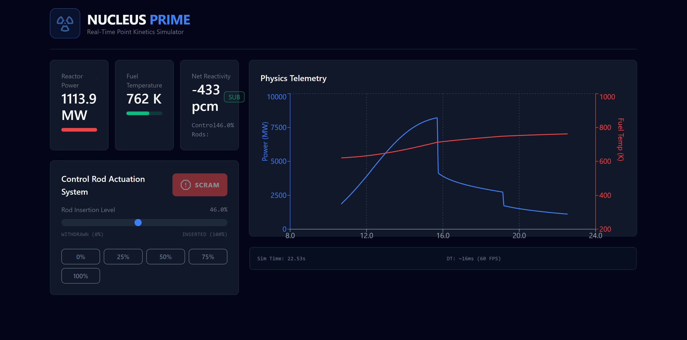

# Nucleus Prime: Real-Time Point Kinetics Simulator



## Overview
**Nucleus Prime** is a high-fidelity, real-time simulation of a nuclear reactor core, built to demonstrate the intersection of **Engineering Physics** principles and modern **Full-Stack Web Development**.

Unlike standard "game" simulations, this project solves the **Point Kinetics Equations** with **6-Group Delayed Neutron Precursors** in real-time (60 FPS) within the browser. It accurately models reactivity feedback loops, thermal hydraulics, and transient reactor behavior.

🚀 **Live Demo:** [https://nucleusprime.netlify.app/](https://nucleusprime.netlify.app/)

## ⚛️ Physics Engine Features
The simulation runs on a custom TypeScript physics engine (`reactorCore.ts`) implementing:

* **Point Kinetics Model:** Solves neutron density ($n$) and precursor concentrations ($C_i$) using coupled differential equations.
* **6-Group Delayed Neutrons:** accurately models the "prompt drop" and decay heat tails using standard decay constants ($\lambda_i$) and fractions ($\beta_i$).
* **Reactivity Feedback:**
    * **Doppler Broadening:** Negative temperature coefficient ($\alpha_{fuel}$) for inherent safety.
    * **Moderator Effects:** Coolant temperature feedback loops.
* **Thermal Hydraulics:** Lumped parameter heat transfer model (Fuel $\to$ Clad $\to$ Coolant $\to$ Heat Sink).

## 🛠️ Tech Stack
* **Frontend:** React 18, TypeScript, Vite
* **Visualization:** Recharts (High-performance time-series rendering)
* **UI/UX:** Tailwind CSS, Tremor (Dashboard components), Lucide React
* **Performance:** Runge-Kutta/Euler integration running at 60Hz via `requestAnimationFrame`.

## 🚀 How to Run Locally
1.  Clone the repository
2.  Install dependencies:
    ```bash
    npm install
    ```
3.  Start the development server:
    ```bash
    npm run dev
    ```

## 🧪 Simulation Guide for Users
* **Startup:** The reactor begins at low power. Withdraw control rods (Slider $\to$ 0%) to introduce positive reactivity.
* **Criticality:** Observe the exponential power rise. As fuel temperature increases, Doppler feedback will introduce negative reactivity, eventually stabilizing the core.
* **Transients:** Rapid insertion of rods will demonstrate the "Prompt Jump" phenomenon where prompt neutrons die off instantly, leaving the delayed neutron tail.
* **Safety:** The simulation demonstrates **inherent passive safety**; if left uncontrolled, the reactor will self-stabilize at a higher temperature rather than runaway, strictly adhering to negative feedback physics.

---
*Designed and engineered by Muqtadir Hussain*